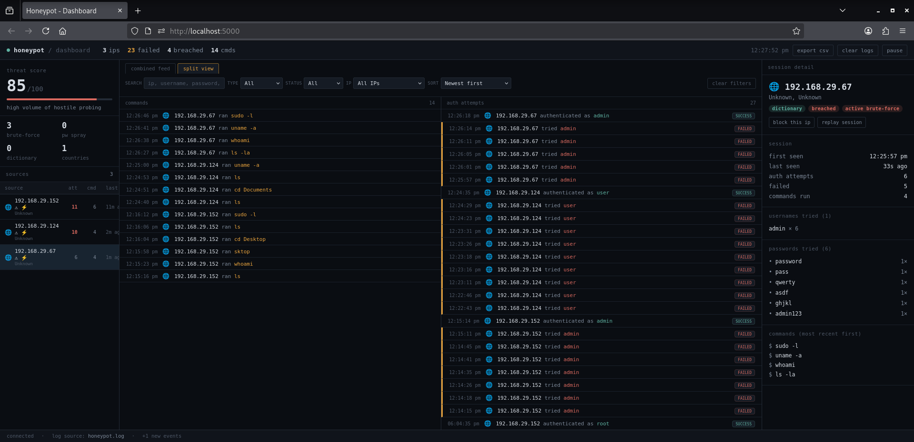
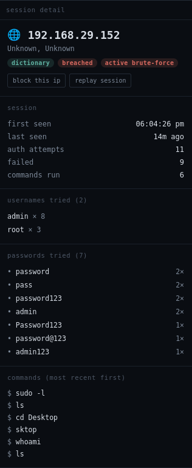

# SSH Honeypot & Live Threat Dashboard

A Python SSH honeypot that logs and analyzes real attack traffic, paired
with a live web dashboard for investigating what attackers do once they
connect — credentials tried, commands run, and basic attack-pattern
detection (brute-force, dictionary, password-spray).

I built this as a hands-on way to learn how honeypots, SSH internals, and
security monitoring dashboards actually work — not as a production
security tool. See [What I learned](#what-i-learned--how-it-was-built) for
the debugging story, and [Security notes](#security-notes) for how to run
it safely.

<!-- Replace with your screenshot: docs/screenshot-dashboard.png -->


## What it does

- **Fake SSH server** ([`honeypot.py`](honeypot.py)) built on
  [Paramiko](https://www.paramiko.org/). Accepts connections on a
  configurable port, offers a list of intentionally weak decoy credentials,
  and drops anyone who guesses one into a simulated interactive shell.
  Common commands (`ls`, `whoami`, `cat /etc/passwd`, `uname -a`, etc.)
  return realistic canned output. Every connection, credential attempt,
  and command is logged.
- **Live dashboard** ([`interface.py`](interface.py) +
  [`templates/index.html`](templates/index.html)): a Flask backend that
  tails the log file, enriches each attacker's IP with GeoIP data, and
  streams events to the browser in real time over Server-Sent Events. The
  frontend is a from-scratch console (no frontend framework) that lets you:
  - See a **live threat score** and counts of detected attack patterns
  - Browse **sources** (attacking IPs) ranked by activity, with pattern
    badges (`brute-force`, `dictionary`, `pw spray`)
  - **Filter and sort** the log feed by IP, type, status, or free-text
    search, in a combined feed or a commands/auth split view
  - **Drill into a session**: every username and password an IP tried,
    every command it ran (dangerous ones flagged), and a **replay** that
    steps through its commands like a terminal recording
  - Get **toast + sound alerts** on a successful login or a burst of 5+
    failed attempts within 2 minutes
  - Copy a ready-to-run `iptables`/`fail2ban`/`ufw` command to block an IP
    (this only copies text — it never touches your firewall automatically)
  - Export logs to CSV

<!-- Replace with your screenshot: docs/screenshot-session.png -->


## Why this project

I wanted to understand, at a code level, three things that come up
constantly in security-engineering roles:

1. **How attackers actually behave** against exposed SSH — what
   credentials get tried first, how fast brute-force attempts come in,
   what commands run once someone's "in."
2. **How to build a monitoring pipeline** — structured logging, parsing,
   real-time streaming to a UI — rather than just reading about SIEM/log
   pipelines abstractly.
3. **How to reason about the security of the tool itself** — a honeypot
   that's poorly built (predictable, exploitable, or that logs real
   secrets insecurely) defeats its own purpose.

## Requirements

- Python 3.8+
- No root/sudo needed with the default port (2222). See
  [Running on port 22](#running-on-port-22-optional) if you want to mimic
  a real SSH server on the standard port.

## Installation & usage

```bash
git clone https://github.com/shajithjosephsebastian/SSH-Honeypot.git
cd SSH-Honeypot
```

Easiest path — the launcher script handles the virtual environment,
dependencies, port checks, and starting both services:

```bash
./run.sh
```

Or run each piece manually:

```bash
python3 -m venv honeypot-env
source honeypot-env/bin/activate
pip install -r requirements.txt

python3 honeypot.py       # starts the fake SSH server on port 2222
python3 interface.py      # starts the dashboard on http://localhost:5000, in another terminal
```

Test it:

```bash
ssh -p 2222 root@localhost
# try a wrong password, then password123 (see FAKE_USERS in honeypot.py for the full list)
```

Then open **http://localhost:5000** to watch it show up on the dashboard.

### Running on port 22 (optional)

By default the honeypot binds to **port 2222** — a non-privileged port, so
no `sudo` is needed and it won't collide with a real SSH daemon on the same
machine. To make it look like a real SSH server to internet traffic, change
`PORT = 2222` to `PORT = 22` in `honeypot.py`. This needs root and will
conflict with any real SSH daemon on the same host — move that to a
different port first, or run the honeypot on an isolated/dedicated machine.

## Decoy credentials

A fixed list of common weak username/password pairs (`root:password123`,
`admin:admin123`, `pi:raspberry`, etc.) lives in `FAKE_USERS` at the top of
`honeypot.py` — edit it to add, remove, or change what the honeypot
"accepts."

## Web dashboard API

| Endpoint | Description |
|---|---|
| `GET /api/logs` | Recent log entries. Supports `limit`, `filter`, `type`, `status`, `ip` query params. |
| `GET /api/stats` | Summary counters (total attempts, unique IPs, top usernames, etc). |
| `GET /api/patterns` | Attack pattern analysis (brute-force/dictionary/spray detection, geo distribution, attack score). |
| `GET /api/geo/<ip>` | GeoIP lookup for a specific IP. |
| `GET /api/stream` | Server-Sent Events stream of new log entries. |
| `GET /api/export?format=csv` | Export logs as CSV. |
| `GET /api/clear-cache` | Clears the server's in-memory log cache (does not touch `honeypot.log` on disk). |

## What I learned / how it was built

This started as a fairly simple fake-SSH-server script and grew into a
small monitoring pipeline. A few real bugs I ran into and fixed along the
way, because they were genuinely instructive:

- **The host SSH key wasn't actually persisting.** I was saving it with
  `str(key)`, which — I learned the hard way — returns the *public* key
  blob in paramiko, not something you can reload as a private key. The
  honeypot silently generated a brand-new host key on every restart,
  which would make any real SSH client complain about the host key
  changing. Fixed with `key.write_private_key_file(...)`.
- **A "DANGEROUS" marker was leaking into logged command text.** I
  tagged dangerous commands (`rm`, `wget`, etc.) by appending a suffix to
  the same string that got logged and parsed back out — so `rm -rf /`
  came back out of the log as `rm -rf / DANGEROUS`, corrupting the stored
  command. Separated the console-only marker from the persisted log line.
- **The dashboard's cached state could go stale.** Local browser storage
  (so a page refresh doesn't lose your session) could disagree with the
  server's log file if it was ever cleared or rotated outside the
  dashboard — the UI kept showing attackers the server had already
  forgotten about. Added a reconciliation check: if cached history shares
  no IDs with what the server currently reports, treat the cache as
  stale and drop it.
- **Dependency-check false positives in the launcher script.** `run.sh`
  checked for installed packages by importing the PyPI package name
  directly (`import Flask`), which doesn't match the real importable
  module name (`flask`) — so it kept reporting installed packages as
  missing and reinstalling them on every launch.

## Security notes

- **Isolate it.** Run this on a sandboxed VM, container, or dedicated box
  — never on a machine with anything sensitive on it.
- **Attackers get a fake shell, not real code execution.** Commands are
  matched against a fixed list of canned responses; anything unrecognized
  returns `command not found`. There's no real shell or interpreter behind
  it.
- **GeoIP lookups call an external, unauthenticated API**
  ([ip-api.com](https://ip-api.com)) for every new IP seen — be aware of
  that outbound traffic if you're running this somewhere network-restricted.
- **The host SSH key and log files are gitignored** and should never be
  committed — see `.gitignore`.
- Firewall the dashboard (port 5000) so it's only reachable by you, not
  the public internet.

## Project structure

SSH-Honeypot/
├── honeypot.py # Fake SSH server (Paramiko)
├── interface.py # Flask web dashboard backend
├── templates/
│ └── index.html # Dashboard UI (vanilla JS, no framework)
├── run.sh # Setup/launcher script
├── requirements.txt
└── README.md